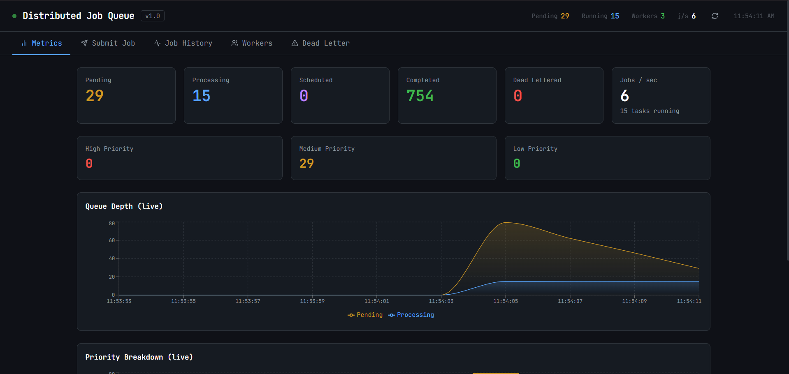
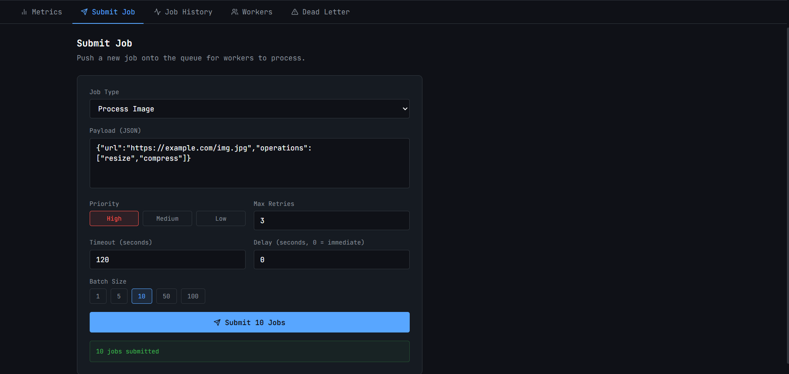
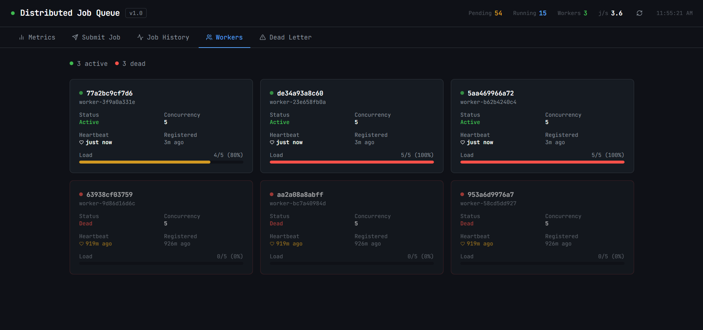
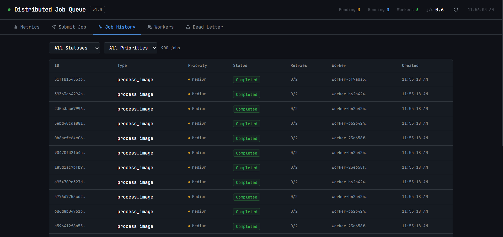
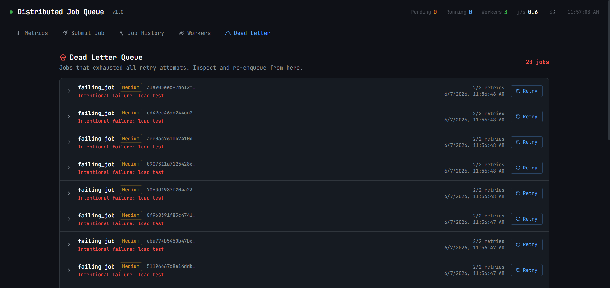

# Distributed Job Processing Platform

[](https://github.com/AdithyaRaoK14/Distributed-Job-Processing-Platform/actions/workflows/ci.yml)


A production-inspired background job queue built from scratch — similar to Celery or BullMQ. Supports priority queues, scheduled jobs, automatic retries with exponential backoff, dead-letter queuing, idempotency keys, distributed workers with heartbeat monitoring, and a real-time React dashboard.

> **Scope note**: This project demonstrates distributed systems patterns (at-least-once delivery, priority queuing, heartbeat-based failure detection) in a realistic setting. It intentionally omits concerns outside its scope — authentication, rate limiting, distributed tracing, and production monitoring.

## Screenshots

### Live Metrics Dashboard


### Job Submission


### Worker Health Cards


### Job History


### Dead Letter Queue


## Measured Performance

All numbers below were measured on a local Windows machine with Docker Desktop (3 worker containers, 5 concurrency each = 15 parallel slots).

| Metric | Value |
|--------|-------|
| Submission throughput | ~100 jobs/sec |
| Processing throughput | ~8.7 jobs/sec (process_image workload) |
| Completion rate | 200/200 (100%) under sustained load |
| E2E latency P50 | 12.2s |
| E2E latency P95 | 22.1s |
| E2E latency P99 | 23.1s |
| Worker nodes | 3 Docker containers |
| Concurrency per worker | 5 (configurable) |
| Passing tests | 43 |

**On the latency numbers**: P50 of 12 seconds is queue waiting time, not processing time. With 15 parallel slots and 200 process_image jobs (each sleeping 0.5–3s, avg ~1.75s), the expected wall time is `200 × 1.75 / 15 ≈ 23s` — which matches the measured 23.45s exactly. Adding workers reduces latency linearly.

## Architecture

```
┌──────────────┐    submit     ┌─────────────┐    BZPOPMIN   ┌──────────────┐
│   React UI   │ ──────────►  │   FastAPI   │ ◄──────────── │   Worker 1   │
│  Dashboard   │              │   Backend   │               ├──────────────┤
└──────────────┘              │             │    BZPOPMIN   │   Worker 2   │
                              │  Orchestr.  │ ◄──────────── ├──────────────┤
                              └──────┬──────┘               │   Worker 3   │
                                     │                       └──────────────┘
                           ┌─────────┴─────────┐
                           │                   │
                     ┌─────▼──────┐    ┌───────▼──────┐
                     │   Redis    │    │  PostgreSQL  │
                     │            │    │              │
                     │ jq:pending │    │ jobs table   │
                     │ jq:process │    │ workers table│
                     │ jq:schedul │    └──────────────┘
                     └────────────┘
```

### Priority Queue Scoring

Jobs are stored in a Redis Sorted Set (`jq:pending`). `BZPOPMIN` always pops the lowest score — so lower score = higher priority:

```
HIGH   →  score =                    0 + timestamp_ms  (band: 0 .. ~2e12)
MEDIUM →  score = 2_000_000_000_000 + timestamp_ms  (band: 2e12 .. ~4e12)
LOW    →  score = 4_000_000_000_000 + timestamp_ms  (band: 4e12 .. ~6e12)
```

Within the same priority level, jobs are processed FIFO by submission time.

**Starvation caveat**: this design does not prevent starvation. If high-priority jobs arrive continuously, low-priority jobs will wait indefinitely — there is no aging or priority escalation mechanism.

### Delivery Guarantee: At-Least-Once

1. Worker pops a job from `jq:pending` (atomic `BZPOPMIN`)
2. Writes `worker_id:job_id` to `jq:processing` sorted set with `score = now + timeout`
3. There is a **brief non-atomic window** between the pop and the processing-set write. If a worker crashes in that window, the job is lost. This is the known gap without Lua scripting.
4. If a worker crashes after step 2, the orchestrator detects the stale processing-set entry past its deadline and requeues the job.

**This system guarantees at-least-once delivery, not exactly-once.** The same job can execute more than once if a worker completes it but crashes before updating the database. Handlers that require exactly-once semantics must be idempotent at the application level.

### Idempotency Keys

Submit with an `idempotency_key` to safely retry submissions without risk of duplicate job creation:

```json
{ "type": "send_email", "payload": {...}, "idempotency_key": "invoice-42-email" }
```

If a job with the same key already exists, the API returns the existing job (HTTP 200) instead of creating a new one. The key has a database-level `UNIQUE` constraint — concurrent submissions race to the constraint, and the loser gets the winner's job back via an `IntegrityError` catch.

**Limit**: idempotency keys deduplicate at submission time only. They do not prevent a single job from executing more than once if the worker crashes after executing but before marking completion.

## Quick Start

### Prerequisites
- Docker Desktop (Docker Compose v2)

### Run

```bash
git clone https://github.com/AdithyaRaoK14/Distributed-Job-Processing-Platform.git
cd distributed-job-queue

docker compose up --build -d

# Dashboard
open http://localhost:3000

# API docs (Swagger)
open http://localhost:8000/docs
```

### Verify workers are up before benchmarking

```bash
# Wait ~30 seconds after startup, then confirm 3 active workers
curl http://localhost:8000/api/workers
```

All three should show `"status": "active"` with recent `last_heartbeat` timestamps.

### Scale Workers

```bash
# Scale up
docker compose up -d --scale worker=6

# Scale back down (note: scaled-down containers are killed abruptly;
# the orchestrator detects the missed heartbeats and requeues their jobs)
docker compose up -d --scale worker=2

# Full reset to a known state
docker compose down -v && docker compose up -d
```

### Run Tests

```bash
pip install -r backend/requirements.txt fakeredis aiosqlite pytest-cov
pip install -r worker/requirements.txt

# All tests
pytest tests/ -v

# With coverage
pytest tests/ -v --cov=backend/app --cov-report=term-missing
```

### Load Test

```bash
pip install httpx

# Submission throughput
python scripts/load_test.py --jobs 500 --concurrency 50 --type noop

# End-to-end with latency percentiles
python scripts/load_test.py --jobs 200 --type process_image --wait

# Retry behaviour (70% failure rate)
python scripts/load_test.py --jobs 50 --type flaky_job --wait

# Dead-letter queue
python scripts/load_test.py --jobs 20 --type failing_job
```

## Project Structure

```
distributed-job-queue/
├── backend/                  # FastAPI application
│   └── app/
│       ├── main.py           # App entry, lifespan, CORS
│       ├── config.py         # Pydantic settings
│       ├── database.py       # SQLAlchemy async engine
│       ├── models.py         # Job + Worker ORM models
│       ├── schemas.py        # Pydantic request/response schemas
│       ├── orchestrator.py   # Background heartbeat + scheduler sweep
│       ├── api/
│       │   ├── jobs.py       # Submit (with idempotency), list, retry, delete
│       │   ├── workers.py    # Heartbeat, list workers
│       │   └── metrics.py    # Queue depth, throughput, stats
│       └── queue/
│           └── redis_queue.py # Priority queue, scheduling, processing set
├── worker/                   # Standalone worker process
│   ├── worker.py             # Main loop, retry logic, heartbeat
│   └── job_handlers.py       # Pluggable job type handlers
├── frontend/                 # React + Vite + Tailwind dashboard
│   └── src/
│       ├── App.jsx
│       └── components/
│           ├── QueueMetrics.jsx     # Live area/bar charts (Recharts)
│           ├── JobSubmitter.jsx     # Submit form with batch support
│           ├── JobList.jsx          # Filterable job history table
│           ├── WorkerHealth.jsx     # Worker cards with load bars
│           └── DeadLetterQueue.jsx  # DLQ viewer with retry button
├── tests/                    # Pytest test suite (43 tests)
│   ├── conftest.py
│   ├── test_api_jobs.py      # API integration + idempotency tests
│   ├── test_queue.py         # Redis queue unit tests
│   └── test_worker.py        # Worker retry/DLQ logic tests
├── scripts/
│   └── load_test.py          # Async load tester with P50/P95/P99 output
├── docs/screenshots/         # Dashboard screenshots (see above)
├── .github/workflows/ci.yml  # GitHub Actions: test + lint + build + integration
└── docker-compose.yml
```

## API Reference

### Jobs

| Method | Path | Description |
|--------|------|-------------|
| `POST` | `/api/jobs/submit` | Submit a new job (idempotency_key supported) |
| `GET`  | `/api/jobs` | List jobs (filter by status/priority) |
| `GET`  | `/api/jobs/{id}` | Get job details |
| `POST` | `/api/jobs/{id}/retry` | Retry a dead-lettered job |
| `DELETE` | `/api/jobs/{id}` | Delete a job |
| `GET`  | `/api/jobs/dead-letter/list` | List dead-lettered jobs |

### Workers

| Method | Path | Description |
|--------|------|-------------|
| `GET`  | `/api/workers` | List all workers and their status |
| `POST` | `/api/workers/heartbeat` | Worker heartbeat registration |

### Metrics

| Method | Path | Description |
|--------|------|-------------|
| `GET`  | `/api/metrics` | Queue depths, throughput, worker counts |

### Submit payload

```json
{
  "type": "process_image",
  "payload": { "url": "https://example.com/img.jpg" },
  "priority": "high",
  "max_retries": 3,
  "timeout_seconds": 120,
  "delay_seconds": 30,
  "idempotency_key": "optional-dedup-key"
}
```

## Job Types

| Type | Description | Simulated duration |
|------|-------------|-------------------|
| `noop` | Instant no-op (benchmarking) | <1ms |
| `process_image` | Image resize + compress | 0.5–3s |
| `send_email` | SMTP send | 0.1–0.8s |
| `generate_report` | Report generation | 0.5–3s |
| `data_pipeline` | ETL pipeline | 0.1–2s |
| `slow_job` | Timeout testing | 90s |
| `failing_job` | Always fails → DLQ | instant |
| `flaky_job` | 70% failure rate → retry | instant |

## Environment Variables

| Variable | Default | Description |
|----------|---------|-------------|
| `DATABASE_URL` | `postgresql+asyncpg://...` | Backend PostgreSQL URL |
| `REDIS_URL` | `redis://redis:6379` | Redis connection URL |
| `HEARTBEAT_TIMEOUT` | `45` | Seconds before worker marked dead |
| `ORCHESTRATOR_INTERVAL` | `10` | Seconds between orchestrator sweeps |
| `WORKER_CONCURRENCY` | `5` | Concurrent jobs per worker |
| `JOB_TIMEOUT` | `120` | Default job timeout (seconds) |

## What This Project Does Not Include

Deliberately out of scope:

- **Authentication** — API is open; a real deployment needs JWT or API keys
- **Rate limiting** — no per-client submission throttling
- **Distributed locking** — the orchestrator assumes a single instance; multiple orchestrators could cause duplicate requeues
- **Distributed tracing** — no OpenTelemetry integration
- **Exactly-once delivery** — would require atomic Lua scripting for pop+mark and idempotent handler enforcement at the execution layer
